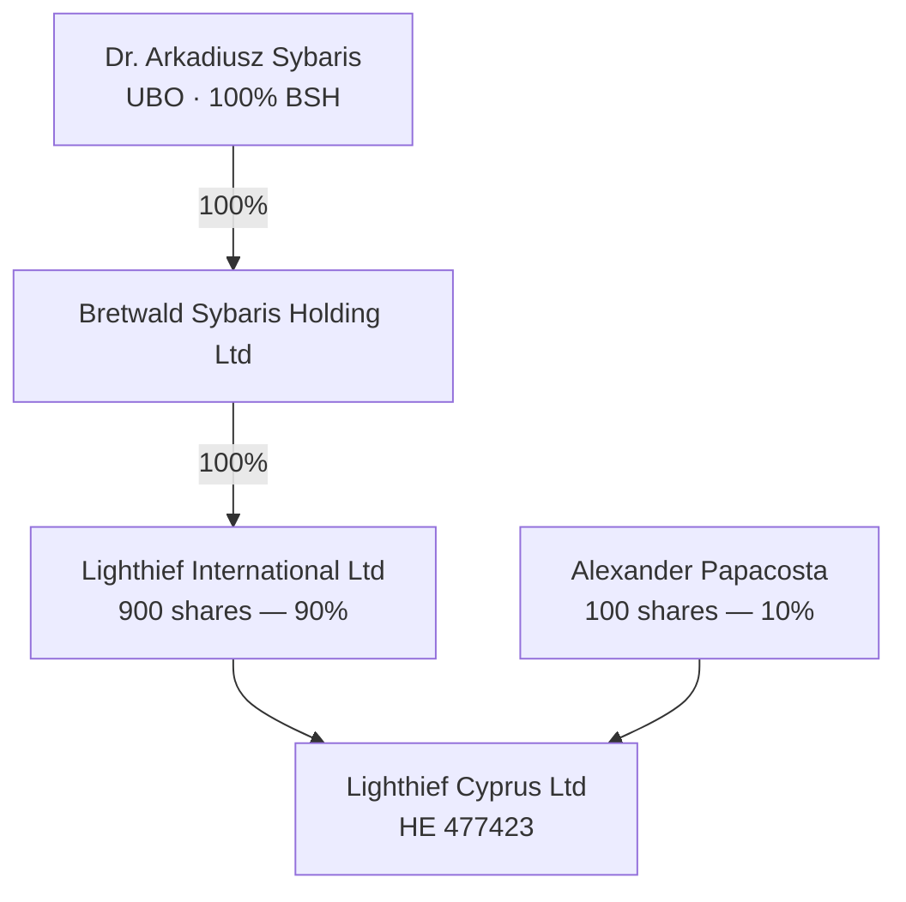

# Signing Matrix & Governance — Lighthief Cyprus Ltd

**Ref:** LCY-GOV-SIGN-2026-003  
**Status:** EXECUTION GUIDE — use with counsel before signing  
**Company:** Lighthief Cyprus Ltd (HE 477423)  
**Cap table (confirmed):** Lighthief International Ltd **900 shares (90%)** · Alexander Papacosta **100 shares (10%)**  
**UBO:** Dr. Arkadiusz Sybaris — **100%** of Bretwald Sybaris Holding Ltd → **100%** of Lighthief International Ltd → **90% effective** in LCY

---

## 1. Corporate structure (signing logic)

| Entity / person | Role | Signs as |
|-----------------|------|----------|
| **Dr. Arkadiusz Sybaris** | **UBO** — 100% shareholder of Bretwald Sybaris Holding Ltd; authorised signatory of LI; Sybaris Capital director | (a) **For LI** on shareholder resolutions; (b) **Personally** on Annex B and side letter Founder line; (c) **For LI** as corporate director at LCY board |
| **Bretwald Sybaris Holding Ltd** | 100% parent of Lighthief International Ltd | Not a direct LCY signatory |
| **Lighthief International Ltd** | **90% shareholder** of LCY (900 shares); 100% owned by BSH | Shareholder resolutions **for the 90% block** |
| **Alexander Papacosta** | **10% shareholder**; LCY director & secretary; MD (employee); Moi Ostrov director | (a) LCY contracts; (b) **shareholder resolutions for the 10% block**; (c) unanimous / 100% SHR where required |
| **Lighthief International Ltd** | LCY corporate director (if on register) | Represented at board by **Dr. Arkadiusz Sybaris** | Shareholder approvals for LI’s block = **Sybaris for LI**. Where **Alexander’s 10% signature** is required (unanimous consent, SHA, or resolutions affecting his shares), **both** LI and **Alexander** sign. UBO personal undertakings = **Sybaris in personal capacity**. Company contracts = **Alexander for LCY** (where authorised by board + shareholder resolution).

**Statutory note:** At **90%**, LI can pass ordinary and special resolutions without Alexander’s vote — **unless** the articles or a shareholders’ agreement require unanimous consent or grant Alexander reserved matters. Counsel to confirm.

---

## 2. Master signing matrix

| Part | Document | Ref | Who signs | Capacity | Witness? |
|------|----------|-----|-----------|----------|----------|
| 5 | Consultancy Agreement (deed) | LCY-MOI-TOCA-2026-001 | **Alexander Papacosta** | Director, Lighthief Cyprus Ltd | Yes (deed) |
| 5 | Consultancy Agreement (deed) | LCY-MOI-TOCA-2026-001 | **Alexander Papacosta** | Director, Moi Ostrov Ltd | Yes (deed) |
| 6 | Annex A — Shareholder Resolution | (within TOCA) | **Dr. Arkadiusz Sybaris** | Authorised signatory, Lighthief International Ltd (90%) | No |
| 6 | Annex A — Shareholder Resolution | (within TOCA) | **Alexander Papacosta** | Shareholder (10%) — **if unanimous / SHA requires** | No |
| 7 | Annex B — UBO Personal Undertaking | (within TOCA) | **Dr. Arkadiusz Sybaris** | **Personal** — UBO (not LI) | Yes (deed) |
| 8 | MD Employment Agreement | LCY-EMP-AP-2026-001 | **Alexander Papacosta** | Director, LCY *(employer — per SHR auth)* | No |
| 8 | MD Employment Agreement | LCY-EMP-AP-2026-001 | **Alexander Papacosta** | Employee (personal) | No |
| 9 | Shareholder Resolution — Employment | LCY-SHR-EMP-2026-001 | **Dr. Arkadiusz Sybaris** | For Lighthief International Ltd (90%) | No |
| 9 | Shareholder Resolution — Employment | LCY-SHR-EMP-2026-001 | **Alexander Papacosta** | Shareholder (10%) — **if unanimous / SHA requires** | No |
| 10 | Equity Side Letter | LCY-MD-EQ-2026-001 | **Dr. Arkadiusz Sybaris** | Founder / for Lighthief International Ltd | No |
| 10 | Equity Side Letter | LCY-MD-EQ-2026-001 | **Alexander Papacosta** | Director, LCY (acknowledgement) | No |
| 10 | Equity Side Letter | LCY-MD-EQ-2026-001 | **Alexander Papacosta** | MD (personal) | No |
| 11 | Option A — Heads of Terms | LCY-OPT-A-2026-001 | **Alexander Papacosta** | Director, LCY | No |
| 11 | Option A — Heads of Terms | LCY-OPT-A-2026-001 | **Dr. Arkadiusz Sybaris** | Founder | No |
| 11 | Option A — Heads of Terms | LCY-OPT-A-2026-001 | **Alexander Papacosta** | MD (personal) | No |
| 13 | Director & Officer Protections | LCY-DIR-IND-2026-001 | **Alexander Papacosta** | Director, LCY + Beneficiary | No |
| 13 | Director & Officer Protections | LCY-DIR-IND-2026-001 | **Dr. Arkadiusz Sybaris** | Shareholder consent, Lighthief International Ltd (90%) | No |
| 13 | Director & Officer Protections | LCY-DIR-IND-2026-001 | **Alexander Papacosta** | Shareholder consent (10%) — **if unanimous / SHA requires** | No |
| 14 | Shareholder Resolution — D&O | LCY-SHR-DO-2026-001 | **Dr. Arkadiusz Sybaris** | For Lighthief International Ltd (90%) | No |
| 14 | Shareholder Resolution — D&O | LCY-SHR-DO-2026-001 | **Alexander Papacosta** | Shareholder (10%) — **if unanimous / SHA requires** | No |
| 16 | Board Minutes — Phase 1 | LCY-BRD-2026-001 | **Alexander Papacosta** | Secretary (certifies minutes) | N/A |
| 16 | Board Minutes — Phase 1 | LCY-BRD-2026-001 | **Dr. Arkadiusz Sybaris** | Chair / LI corporate director | N/A |
| 17 | Board Minutes — Phase 2 | LCY-BRD-2026-002 | Same as Phase 1 | Pre-investor side letter | N/A |
| 12 | Deed of Group Adherence | LCY-MOI-ADH-2026-001 | Per entity | Before each Group entity touches Cyprus work | Counsel |

---

## 3. Execution phases & order

### Phase 1 — Founder alignment (before / with Galascope EPC recommendation)

| Step | Action | Signatory |
|------|--------|-----------|
| 1a | Hold **LCY Board Meeting** (Part 16 minutes) | Sybaris + Alexander (AP recuses conflict items) |
| 1b | **Annex B** — UBO personal undertaking | **Sybaris personal** |
| 1c | **Annex A** — shareholder resolution (Moi Ostrov) | **Sybaris for LI** (+ **Alexander** if unanimous / SHA requires) |
| 1d | **LCY-SHR-EMP-2026-001** — employment approval | **Sybaris for LI** (+ **Alexander** if unanimous / SHA requires) |
| 1e | **LCY-SHR-DO-2026-001** — D&O + indemnity | **Sybaris for LI** (+ **Alexander** if unanimous / SHA requires) |
| 1f | **Consultancy deed** (LCY + Moi Ostrov) | **Alexander** both sides |
| 1g | **Employment agreement** | **Alexander** employer + employee |
| 1h | **D&O deed** (LCY-DIR-IND-2026-001) | **Alexander** + **Sybaris** (SH consent) |
| 1i | **Option A** heads (if binding now) | **Sybaris** Founder + **Alexander** Company/MD |
| 1j | Secretary files resolutions + minutes in statutory books | **Alexander** as secretary |

### Phase 2 — Before first investor tranche

| Step | Action | Signatory |
|------|--------|-----------|
| 2a | Hold **LCY Board Meeting** (Part 17 minutes) | Sybaris chairs; AP recused on equity terms |
| 2b | Shareholder resolution approving side letter *(if counsel requires separate SHR)* | **Sybaris for LI** (+ **Alexander** if unanimous / SHA requires) |
| 2c | **Equity side letter** executed | **Sybaris** Founder + **Alexander** Company/MD |

### Phase 3 — Galascope EPC

| Step | Action | Signatory |
|------|--------|-----------|
| 3a | Board minute approving EPC execution | **Alexander** + **Sybaris** (LI director) |
| 3b | Galascope EPC contract | Per EPC execution block |

---

## 4. Recusal map (Section 191, Cap. 113)

| Agenda item | Alexander Papacosta | Dr. Sybaris (for LI) |
|-------------|---------------------|----------------------|
| Moi Ostrov consultancy approval | **Recused** — disclose interest; provide info only | **Votes / approves** |
| MD employment approval | **Recused** | **Votes / approves** |
| D&O deed (beneficiary = AP) | **Recused** | **Votes / approves** |
| Authorise AP to sign LCY documents | May participate (no personal benefit in authorisation itself) | **Votes / approves** |
| Equity side letter | **Recused** | **Votes / approves** |
| Galascope EPC (commercial) | May participate if no personal conflict | **Votes / approves** |

Minutes must record disclosure, withdrawal, and that the interested director did not vote.

---

## 5. What Sybaris signs in two different hats

| Hat | Documents | Signature line |
|-----|-----------|----------------|
| **A — Shareholder (LI, 90%)** | Annex A, LCY-SHR-EMP-2026-001, LCY-SHR-DO-2026-001, optional side-letter SHR | "For and on behalf of **Lighthief International Ltd**" |
| **A2 — Shareholder (Alexander, 10%)** | Same resolutions when **unanimous consent**, SHA, or resolution affects AP’s shares | "**Alexander Papacosta**" — shareholder |
| **B — UBO personal** | Annex B only | "**I, Dr. Arkadiusz Sybaris**" — personal undertaking |
| **C — Founder (equity)** | Side letter, Option A | "Dr. Arkadiusz Sybaris" / Founder (may also reference LI) |
| **D — Board (LI corporate director)** | Board minutes — chair / LI director present | Minutes attendance block |

**Annex B must not be signed "for Lighthief International"** — it is personal.

---

## 6. Pre-sign checklist (summary)

- [ ] Payroll reconciliation Jul 2025–present (employment)  
- [ ] Sybaris obtained independent legal advice (§7.1(f))  
- [ ] D&O quote obtained; secretary named  
- [ ] Articles permit indemnity  
- [ ] Registrar: LI corporate director + Sybaris as authorised rep  
- [ ] ROC extracts: LCY, LI, BSH — attach to bank KYC pack  
- [ ] Confirm whether SHA or articles require **Alexander’s signature** on employment / D&O / equity SHRs  
- [ ] Witnesses arranged for **deeds** (Consultancy Agreement, Annex B)  
- [ ] No named investor in side letter / Option A if investor may read  

---

*End of signing matrix — not legal advice.*
