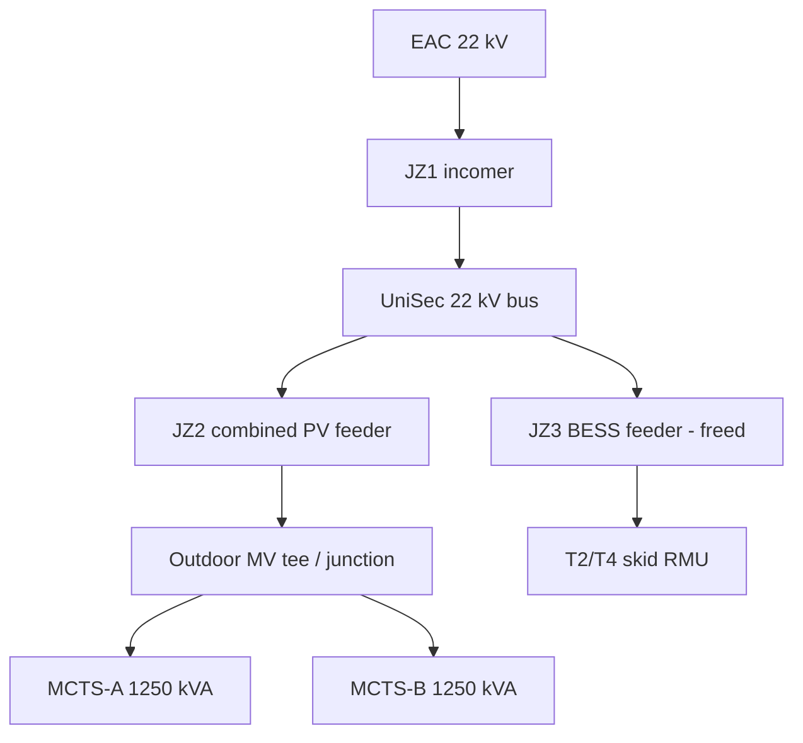

# Galascope Rev F / Rev G — MV Connection Strategy

> **Rev F:** SwS-level — merge PV on **JZ2**, BESS on freed **JZ3** (ABB **UniSec**, no new cubicle).  
> **Rev G:** Field-level — **how** two adjacent **1250 kVA** pads (~**10–12 m**) are coupled (**G1a / G1b / G1c**). See [`galascope-revG-field-coupling.md`](galascope-revG-field-coupling.md).  
> **Status:** Engineering concept — **requires MCTS / EAC approval** before construction.

---

## 1. Problem statement

| Revision | Approach | Blocker |
|----------|----------|---------|
| **Rev D** | New indoor MV cubicle (JZ4/JZ5) + cable to BESS | Cost (€28–46k BoP), SM6 compatibility wrong vs **ABB UniSec** as-built |
| **Rev E** | Repurpose an existing SwS bay without new cubicle | Assumes a **spare or low-value bay** — photo shows **≥4 active cubicles**; not proven which bay is free |
| **Rev F** | **Disconnect one PV SwS feeder**, **tee two 1250 kVA transformers** onto the remaining PV feeder, use **freed bay (JZ3)** for BESS | Client civil/MCTS works + relay coordination + transformer matching |
| **Rev G** | Same SwS as Rev F; documents **G1a / G1b / G1c** field coupling between two pads | [`galascope-revG-field-coupling.md`](galascope-revG-field-coupling.md) |

---

## 2. As-built topology (confirmed)

### Customer SwS (both parks — Famagusta)

- **ABB UniSec** 24 kV, **16 kA / 1 s**, **200 A** class (photo + 2.5 MW MCTS data).
- Internal labels in BESS studies: **JZ1** = EAC/grid incomer, **JZ2 / JZ3** = PV park MV feeders (to field MCTS buildings), **JZ4** = spare or future (Rev D assumption).

### Field plant

| Site | MCTS drawing | Transformers on drawing | MV from MCTS to trafo |
|------|--------------|-------------------------|------------------------|
| **G2 — 2.5 MW** | EL00.01.02 | **1× 1250 kVA** on **one** MCTS sheet; satellite **3 pads** (T1/T2/T3) — **walk-down** | JZ1→SwS, JZ2→80 A fuse→trafo |
| **G1 — 5 MW** | EL00.02.02 | **1× 1250 kVA** per sheet (Lami); park **MCTS 1–4** naming | Siemens **8DJH** + **50 mm²** MV cable |

**Corrections:** (1) `SLD-galascope-2.5MW-BESS.html` **“2 × 1250 kVA”** was wrong — fixed to **1×** per EL00.01.02. (2) **Satellite May 2026** shows **three** compound pads on G2 — likely **two** step-up trafos (2×11 inverters) + one other structure; **Rev F/G now applies to G2** with **longer** field cables (~**75–95 m** closest pair). See G2 field doc.

---

## 3. Rev F target single-line (concept)

**Operating steps (outage sequence — indicative):**

1. Curtail / isolate PV; agree outage with EAC/MCTS.
2. De-energize **JZ3** outgoing cable; confirm no back-feed from second MCTS.
3. Install **tee** on **JZ2** outgoing route (or new short link pit) — two MV cables to MCTS-A and MCTS-B HV terminals.
4. Reconfigure **JZ3** cubicle: new **7SJ82**, CT/VT, CB — MV cable to BESS skid RMU (same spec as Rev E).
5. Commission parallel PV (tap check, circulating current, differential if required) then BESS feeder.

---

## 3a. Rev G — Field coupling between two transformer pads (G1 only)

Satellite survey (35.065°N, 33.856°E): **two** transformer pads **~8–12 m** apart. Each has **Siemens 8DJH R+T** (one SwS cable in, one MV out to trafo). **Do not** parallel **800 V** LV buses.

| Option | What to add / swap | 8DJH module swap? | New MV cable |
|--------|-------------------|-------------------|--------------|
| **G1a — Tee** (preferred) | **RSTI-58** (or equiv.) **22 kV tee** on **JZ2** feeder | **None** | **~10–12 m** pad-to-pad, **3×1×50 mm²** Al (as-built type) |
| **G1b — Extend 8DJH** | Extra **8DJH T-unit** on nearest MCTS (**R+T₁+T₂**) | **Add T-module** | **~10–12 m** from **T₂** to far trafo HV |
| **G1c — Ring** | **~10–12 m** ring bus **R₁↔R₂** between MCTS | **None** (if both have **R**) | Ring interconnect only |

**SwS (all options):** Retire **JZ3** → far pad; **JZ3** → **BESS**; **JZ2** → combined PV.

**Drawings:** `LC-G1-SLD-001-F` (summary notes) · `LC-G1-SLD-001-G` (full G1a/b/c notes).

---

## 4. Electrical adequacy

### 4.1 Steady-state current @ 22 kV

| Case | P (MW) | I ≈ P/(√3×22) | SwS 200 A | JZ2 80 A fuse (per MCTS) |
|------|--------|---------------|-----------|---------------------------|
| G2 PV only | 2.5 | **65.6 A** | OK | OK (one MCTS) |
| G1 PV only | 5.0 | **131 A** | OK | **Each** MCTS fuse still **80 A** — one trafo ≈ 65 A each ✓ |
| G2 BESS export | 2.5 | 65.6 A | OK | On **JZ3**, not combined PV fuse |
| G1 BESS export | 5.0 | 131 A | OK | On **JZ3** |

Combined **JZ2** feeder after merge (G1): carries **both** trafos at full PV output → **~131 A** steady-state.

| Component | Rating | Rev F loading | Verdict |
|-----------|--------|---------------|---------|
| UniSec panel | 200 A | ~131 A (66%) | **OK** |
| Combined MV cable (SwS → tee) | Often **50 mm² × 3** per MCTS as-built | **Upgrade likely** to **3×(1×120) Cu** or **3×1×150 Al** (Rev D already sized 120 mm² Cu for BESS) | **Verify / upgrade** |
| Per-MCTS 8DJH fuse | 80 A | ~65 A each trafo | **OK** per MCTS |
| Per-MCTS 50 mm² cable | ~150 A class (Al, 22 kV, est.) | ~65 A each | **OK** |

### 4.2 Parallel transformers (2× 1250 kVA, Dyn11, Uk 6%)

| Criterion | Assessment |
|-----------|------------|
| Vector group | Both **Dyn11** (GALA datasheet + Lami on 5 MW MCTS) — **compatible** |
| Impedance | Both **6%** — **favourable** for circulating current |
| Tap positions | Must be **same tap** before parallel — **MCTS witness required** |
| Neutral earthing | MCTS uses **R=1 Ω** on PV neutral — **do not** parallel LV sides; **HV parallel only** via common MV feeder |
| OEM mismatch | 5 MW as-built **Lami** vs spare **GALA BkAo** — if units differ, **swap one transformer** |

### 4.3 Which field unit to swap (Rev G)

| Option | Swap / add at MCTS |
|--------|-------------------|
| **G1a** | **None** — **RSTI tee** + **~10–12 m** cable only |
| **G1b** | **Add Siemens 8DJH T-module** (**R+T₁+T₂**) on nearest pad |
| **G1c** | **None** — **~10–12 m** **R₁↔R₂** ring cable |

### 4.4 Which oil transformer to swap (if required)

| Priority | Action |
|----------|--------|
| 1 | **Plate survey** both 1250 kVA units |
| 2 | **Lami / GALA mix:** replace mismatched unit with **GALA BkAo 1250 kVA** (`data sheet_1250kVA_11-22-0,8KV_GALA_rev.1.pdf`) |
| 3 | Both **Lami** matched: **no trafo swap** — tap alignment only |

### 4.5 Which SwS cubicle to repurpose

| Cubicle | Rev F role | Rationale |
|---------|------------|-----------|
| **JZ1** | Keep — EAC incomer | Do not touch |
| **JZ2** | **Combined PV feeder** | Retain cubicle with higher-grade protection study; outgoing cable tees to both MCTS |
| **JZ3** | **BESS feeder** (freed) | Today’s **second PV MV cable** — disconnect from field tee, reconnect to BESS skid |
| **JZ4** | Spare / metering / other | Leave unless site survey proves otherwise |

**Unit to “swap” at switchgear:** not a new SM6 module — **re-function the existing JZ3 WBC/SBC feeder cubicle** in the **UniSec** lineup (ABB extension rules), with **7SJ82 + CT/VT** upgrade same as Rev E.

### 4.6 Protection & control

| Topic | Requirement |
|-------|-------------|
| PV combined feeder | Existing **JZ2 relay** may need **overcurrent / thermal** revision for 131 A; check CT ratio |
| Second PV relay | **JZ3 relay** re-assigned to BESS — new **7SJ82** settings |
| Parallel transformers | EAC may require **restricted parallel** or **separate protection** with **HV coupling** only — confirm with MCTS |
| Skid RMU | Unchanged from Rev E — **Schneider RM AirSeT** in Linyang CIF |

---

## 5. Applicability by project

| Project | Rev F trafo merge | Rev F freed bay for BESS | Notes |
|---------|-------------------|--------------------------|-------|
| **Galascope 1 (5 MW)** | **Yes** — if two MCTS/trafos on JZ2+JZ3 | **Yes** — JZ3 → BESS | Primary Rev F candidate |
| **Galascope 2 (2.5 MW)** | **Yes** — if **2–3** field MCTS confirmed (satellite May 2026) | **Yes** — **JZ3** → BESS | Same **F/G** as G1; **~75–95 m** inter-pad MV (not ~10 m). See [`galascope-revG-field-coupling-g2.md`](galascope-revG-field-coupling-g2.md) |

---

## 6. Scope & responsibility split

| Work package | Typical owner |
|--------------|---------------|
| UniSec outage, JZ3 retermination, 7SJ82 | **Client / licensed contractor** + MCTS |
| MV tee pit, dual feeder routing | **Client civil** |
| Transformer swap (if needed) | **Client** — supply **GALA 1250 kVA** or equivalent |
| Tap sync / witness test | **Client + MCTS** |
| MV cable SwS → BESS skid | **Lighthief EPC** (same as Rev E) |
| Skid RMU, BESS, PCS, EMS | **Linyang CIF + Lighthief** |

---

## 7. Risk register

| Risk | Mitigation |
|------|------------|
| EAC rejects HV parallel | Fall back to **Rev D** new cubicle or separate storage connection study |
| 50 mm² combined feeder undersized | Upgrade SwS→tee cable before energization |
| Circulating current between trafos | Matched units, same tap, no LV tie |
| Wrong bay identified on site | **Site walk** with MCTS SLD + label **EL 30004-BV** cubicles before outage plan |
| G2 single-trafo assumption | Do not merge trafos; only Repurpose bay if JZ3 proven spare |

---

## 8. Deliverables in repo

| File | Description |
|------|-------------|
| `galascope-as-built-equipment.md` | Datasheet + MCTS register |
| `../sld/rev-F/` | DXF Rev F |
| `../sld/rev-G/` | DXF Rev G |
| `galascope-revG-field-coupling.md` | G1a / G1b / G1c detail |
| `../scripts/galascope-pandapower-model-revF.py` | G1 parallel-PV load check |
| `../as-built-refs/` | MCTS renders, site photos |

---

## 9. MCTS / EAC RFI checklist

- [ ] Confirm **JZ2** and **JZ3** presently feed **which MCTS** (cable routes, single-line index).
- [ ] Approve **HV parallel** of two 1250 kVA transformers on one SwS feeder.
- [ ] Approve **JZ3** repurposing for **Category B BESS** export/import.
- [ ] Required **combined feeder** cable size and fuse/breaker rating at SwS.
- [ ] Whether **differential protection** is required between parallel trafos.
- [ ] **EAC secure auxiliary** supply for relays when plant isolated (separate from skid aux).

---

*Lighthief Cyprus Ltd — internal engineering — 19 May 2026*
