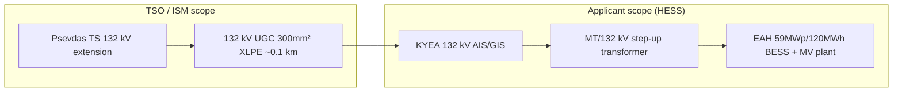

# HESS — TSOC Preliminary Connection Terms (April 2025)

> **Purpose**: Internal reference for **TSOC (ΔΣΜΚ)** Preliminary Connection Terms (`Προκαταρκτικοί Όροι Σύνδεσης` / **ΠΟΣ**) issued to **H.E.S.S Hybrid Energy Storage Systems Ltd** for the standalone BESS at **Psevdas, Larnaca**.  
> **Audience**: Lighthief EPC, HV transformer sizing, KYEA design, client proposals.  
> **Grid code context**: See [`CyprusDSO.md`](../CyprusDSO.md) for general DSO/TSO BESS rules; this file is **project-specific**.

---

## Source document

| Field | Value |
|-------|--------|
| **Title (GR)** | Προκαταρκτικοί Όροι Σύνδεσης — Σύνδεση στο Σύστημα Μεταφοράς |
| **Title (EN)** | Preliminary Connection Terms — Connection to the Transmission System |
| **Issuer** | **ΔΣΜΚ** (TSOC — Cyprus Transmission System Operator) |
| **Ref** | ΔΣΜΚ/ΠΟΣ/320.7.11 |
| **Date issued** | **7 April 2025** |
| **Acceptance deadline** | **6 May 2025** (30 days from issue) |
| **Applicant** | **H.E.S.S Hybrid Energy Storage Systems Ltd** |
| **Location** | Community of **Psevdas (Ψευδάς)**, Larnaca District |
| **Connection application ref** | **320.7.11** (received **27 Sep 2024**) |
| **Construction licence** | **ΚΕΑ14-2024** (5 Jul 2024 – 4 Jul 2029) |
| **Local PDF** | `L:\My Drive\LINYANG\BESS CLIENTS\Individual_60-120-standalone\HV Transformer\Connection Terms HESS - TSO April 2025.pdf` |
| **OCR text** | [`docs/dso/ocr/Connection-Terms-HESS-TSO-April-2025-OCR.txt`](ocr/Connection-Terms-HESS-TSO-April-2025-OCR.txt) |

> **Note**: Source PDF is scanned. Text extracted via `scripts/read_doc.py` (PyMuPDF + Tesseract `eng+ell`, May 2026). Verify critical figures against signed PDF before contractual use.

---

## Project sizing (from ΠΟΣ)

| Parameter | Value | Notes |
|-----------|-------|--------|
| **Installed capacity** | **59 MWp / 120 MWh** | Nameplate in ΠΟΣ |
| **Max discharge @ POC** | **< 50 MW** | Confirmed applicant letter **22 Nov 2024** |
| **Connection voltage** | **132 kV** | Single connection line — **non-firm** (`μη Εξασφαλισμένη Σύνδεση`) |
| **Category** | Standalone **ΕΑΕ** (Energy Storage Installation) | Transmission-level connection |
| **POC boundary (ownership/operation)** | Termination of **132 kV underground transmission cable** at **132 kV AIS switchgear** in **ΚΥΕΑ** | Applicant side from this point |

Single-line diagram (Appendix, drawing ΔΣΜΚ/320.7.11) shows:

| Element | OCR / diagram value |
|---------|---------------------|
| **Step-up transformer** | **55 MVA**, **MT/132 kV** |
| **Vector group** | **YNd11** (diagram: Ynd11) |
| **BESS block label** | **50 MW / 120 MWh** (diagram title) vs **59 MW / 120 MWh** (body text) |
| **132 kV cable** | **300 mm² XLPE**, **3×1c per circuit**, underground |
| **Entry substation** | Extension of **Psevdas TS** 132 kV |

**Transformer sizing note:** Client/EPS `Transformer Requirements.xlsx` and Sofoklis RFQ specify **63 MVA**. TSOC single-line shows **55 MVA**. ΠΟ §5.1(ii) requires MT/132 kV transformer **≥ minimum T14 (Transmission Rules) requirements** — confirm final MVA with EPS/TSOC against **Κεφάλαιο Τ14** before ordering.

---

## Connection architecture (summary)

### TSO / ISM works (§4.2 — outside applicant property)

1. **Extension of Psevdas transmission substation** — new 132 kV UGC bay + protection/telecom. Indicative timeline **2029** (to enter **ΔΠΑΣΜ 2026–2035**).
2. **132 kV underground cable** — single circuit **300 mm² XLPE** from entry TS to ΚΥΕΑ (~**0.1 km** indicative route; cost adjustable per §8).
3. **Metering arrangements** at ΚΥΕΑ — bidirectional main meter + auxiliary consumption meter (ISM/ISD install/program).
4. **ISM support services** — issue ISM specs for applicant equipment (MT/132 kV transformer, 132 kV breakers, MV switchgear, protection, earthing transformer, etc.).

### Applicant works (§5.1 — HESS scope, not in ΚΔΣ)

1. **BESS plant** — 59 MWp / 120 MWh, max discharge < 50 MW; battery + PCS specs subject to TSOC approval before Connection Offer.
2. **MT/132 kV step-up transformer** — ≥ **T14** min MVA; **YNd11**; TSOC approval required.
3. **ΚΥΕΑ (Central Storage Substation)** — outdoor **132 kV AIS or GIS** per Appendix O, including:
   - 132 kV bay for ISM cable termination (3×1c 300 mm² XLPE)
   - MV bay to step-up transformer
   - MV switchgear (eco-gas), protection, control
   - **MT/0.4 kV earthing transformer**
   - Power-quality recorder
   - RTU / telecom to **ECCC** (National Control Centre) and/or TSOC Nicosia
   - LV AC / DC aux supplies
4. **Earthing system** — study per **T14**, TSOC approval.
5. **VTs & CTs** for main metering — **applicant supply**, must meet **Transmission Rules**.
6. **Telecom** to ECCC/TSOC — applicant cost for links and ongoing fees.

Applicant grants **1.2 m cable corridor** easement for ISM underground cable on site.

---

## Capital connection contribution (ΚΔΣ) — indicative April 2025

| Item | Amount (excl. VAT) |
|------|---------------------|
| **Capital cost (ΚΚ)** — ISM connection works | **€689,077** |
| **TSOC admin (2% of ΚΚ)** | **€13,782** |
| **Total ΚΔΣ** | **€702,859** |
| **VAT** | 19% (at time of issue) |

**Payment (Policy of Charges):**

- On ΠΟΣ receipt: TSOC admin **€13,782 + VAT** (max €30,000 cap applies generally).
- Balance after Connection Agreement: advance (remaining admin + **10% ΚΚ**) + **3 equal instalments** (30% ΚΚ each) within **12 months** of signing.
- **Bank guarantee (ΤΕΕ)** within **3 months** of Connection Agreement, covering outstanding ΚΔΣ until paid.

> Figures are **non-binding** budget estimates; final ΚΔΣ in Connection Agreement may change (§8).

---

## Key obligations & milestones

| Topic | Rule |
|-------|------|
| **ΠΟΣ validity** | **12 months** from acceptance (+ one possible **12-month** extension) |
| **Acceptance** | Within **30 days** of 7 Apr 2025 → deadline **6 May 2025** |
| **Applicant works start** | After all permits + **Connection Agreement** signed |
| **ISM works start** | After Connection Agreement + advance + guarantee |
| **Regulatory compliance** | Transmission Rules (in force **4 Nov 2024**), Distribution Rules, Transitional Market Regulation v1.12, Electricity Market Rules (as applicable) |
| **Market participation** | EAH competitive-market framework **under review** (ΠΟΣ §1 note) |

---

## HV transformer — data for Polish producer / EPS questionnaire

| Parameter | Source in ΠΟΣ | Value |
|-----------|---------------|-------|
| Voltage ratio | §5.1(ii), SLD | **MT / 132 kV** |
| Min rating | §5.1(ii) + **T14** | ≥ T14 minimum (SLD shows **55 MVA**) |
| Vector group | §5.1(ii), SLD | **YNd11** |
| Type / location | Client RFQ + KYEA | **Oil-immersed, outdoor** at ΚΥΕΑ |
| 132 kV cable interface | §5.1(iii) | **300 mm² XLPE**, 3×1c per phase at KYEA AIS |
| **132 kV fault level (kA)** | **T1.8.6: 31.5 kA / 1 s** (transmission rules) | Pandapower study: [`analysis/hess-pandapower-results.json`](analysis/hess-pandapower-results.json); site-specific ISM study may override |
| 33 kV / MV side | Private MV plant (BESS skids) | Not defined in ΠΟΣ; client `Transformer Requirements.xlsx` uses **33 kV** |

---

## Related project files

| File | Location |
|------|----------|
| Transformer Requirements (63 MVA 132/33 kV) | `…/HV Transformer/Transformer Requirements.xlsx` |
| PT questionnaire (prefilled) | `…/HV Transformer/PT Technical information-HESS-prefilled-may2026.xlsx` |
| PT gap analysis | `…/HV Transformer/PT-gap-analysis-may2026.md` |
| RfP package | `…/RfP docs/` |
| Transmission Rules incl. T14 | `…/RfP docs/Transmission Connection Rules Includ. T14 for Storage.pdf` |

---

## Revision history

| Date | Version | Changes |
|------|---------|---------|
| 2026-05-27 | 1.0 | OCR of scanned ΠΟΣ PDF; structured README in `docs/dso/` (mirrors net-billing readme pattern) |
