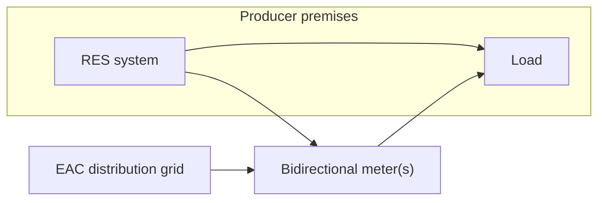

# Cyprus Net Billing Terms 2026

> **Purpose**: Internal reference for EAC (ΑΗΚ) **Net Billing** (`Συμψηφισμός Λογαριασμών`) commercial terms — how exported RES energy is valued, settled, and invoiced.  
> **Audience**: Lighthief project development, EPC, and client proposals (commercial terms only; technical connection rules remain in [`CyprusDSO.md`](../CyprusDSO.md)).

---

## Source document

| Field | Value |
|-------|--------|
| **Title (GR)** | Σύμβαση Συμψηφισμού Λογαριασμών Ηλεκτρικής Ενέργειας |
| **Title (EN)** | Electricity Account Offsetting Agreement (Net Billing) |
| **Issuer** | Αρχή Ηλεκτρισμού Κύπρου — **ΑΗΚ Προμήθεια** (EAC Supply), licence ΠΘ0001/2006 |
| **Version** | **V6** |
| **Date** | 23 March 2026 |
| **Local copy** | `L:\My Drive\EAC CERA DOCS\FINAL ΣΥΜΒΑΣΗ ΣΥΜΨΗΦΙΣΜΟΥ ΛΟΓΑΡΙΑΣΜΩΝ AHK ΠΡΟΜΗΘΕΙΑ V6_23-3-2026.pdf` |
| **Supersedes** | Prior EAC Supply net-billing agreements for the same premises/system (§2.8) |

**Scope of contract**: RES generation systems (`Συστήματα Παραγωγής Ηλεκτρισμού από ΑΠΕ`) **up to 8 MW**, parallel operation with the **distribution network** under the **Net Billing** method.

---

## How net billing works (summary)

For each **billing period** (monthly or bimonthly):

1. **Import** — energy drawn from the grid to the premises (`εισαγόμενη`).
2. **Export** — energy from the RES system fed into the grid (`εξαγόμενη`).
3. **Offset** — import and export are **netted in kWh** for the period (`Συμψηφισμός Λογαριασμών`).
4. **Settlement**:
   - If **export ≤ import** → customer pays the **kWh difference** at the **applicable retail tariff**.
   - If **export > import** → customer receives a **monetary credit** for the surplus kWh at the **RES market purchase price** (see below).

> Net billing is a **billing/settlement** mechanism between producer–consumer and **EAC Supply**. Grid connection, protection, SCADA, and BESS category rules are governed separately by the **DSO** (connection offer, Technical Guide, suitability certificate) — see [`CyprusDSO.md`](../CyprusDSO.md).

---

## Key definitions (contract §2.0)

| Term (GR) | Term (EN) | Meaning |
|-----------|-----------|---------|
| Συμψηφισμός Λογαριασμών | Net Billing | Import from grid offset against export from RES **per billing period** |
| Παραγωγός / Καταναλωτής | Producer / Consumer | Owner of the RES system at the premises |
| Σύστημα Παραγωγής | Generation system | Full RES plant including inverters, protection, metering, telecontrol, etc. |
| Τιμή Αγοράς Ηλεκτρικής Ενέργειας από ΑΠΕ | RES market purchase price | Monthly price EAC Supply pays for surplus export after offset |
| Ημερομηνία Σύνδεσης | Connection date | As in Transmission/Distribution Rules; net billing starts after this (§6.2) |

---

## Regulatory stack (contract preamble)

The agreement binds both parties to the full electricity-market legislative framework. Material references cited in **V6**:

| Reference | Topic |
|-----------|--------|
| **N.130(I)/2021** | Electricity market regulation (Market Rules, Supply Rules, Distribution/Transmission Rules) |
| **N.107(I)/2022** | Promotion and encouragement of RES |
| **CERA Decision 02/2024** (K.Δ.Π. 371/2024) | Competitive market; application from **1 October 2025** |
| **CERA Decision 28/2020** | Ancillary, network-use and other charges for RES self-consumption under support schemes; **billing presentation** for net billing credits |
| **CERA Decision 16/2019** | Charge revision for self-generation / net billing schemes — **domestic tariff code 08 only** (approved by Ministry letter 28/4/2020) |
| **DSO Technical Guide** | Connection and parallel operation — integral annex; if conflict with Grid Codes, **Transmission/Distribution Rules prevail** |
| **TSOC loss methodology** | Shared MV network >20 kW — published at [tsoc.org.cy](https://www.tsoc.org.cy) |
| **CERA licence / exemption / general licence** | Required where applicable |

Hierarchy (§4.3): if contract terms conflict with **Distribution/Transmission Rules**, the **Grid Codes win** unless the contract states otherwise.

---

## Preconditions before signing (§4.4)

All must be satisfied:

1. DSO **inspection** of the RES installation completed successfully.
2. DSO **Certificate of Suitability** (`Πιστοποιητικό Καταλληλότητας`) issued.
3. **CERA licence** (or exemption / general licence) in force where required.
4. DSO **approval** to sign net-billing supply contract with EAC Supply.
5. Signed **Connection & Operation Offer** (`Προσφορά Όρων Σύνδεσης και Λειτουργίας`) and **connection contribution** paid.
6. Producer has signed **Declaration of Acceptance** of the DSO connection offer.

---

## Contract duration (§6.0)

| Item | Rule |
|------|------|
| Initial term | **1 year** from signature |
| Renewal | **Automatic** unless either party gives **30 days' written notice** before expiry |
| Net billing start | **Connection date**, after successful inspection, suitability certificate, licence, and system operation — provided all contract obligations are met |

---

## Metering (§7.1)

| Requirement | Detail |
|---------------|--------|
| Meter type | **Bidirectional** meter recording import and export — **mandatory on all RES systems** |
| Alternative | Two separate meters if bidirectional installation is not feasible |
| Installation | By **DSO**, programmed per Technical Guide |
| Settlement period | **Monthly** or **bimonthly**, depending on **consumer category** |

---

## Settlement and pricing (§7.1) — core commercial terms

### Per-period offset

| Situation | Customer outcome |
|-----------|------------------|
| **Export ≤ import** | Pay the **kWh difference** at the **tariff category** that applies to the premises |
| **Export > import** | **Credit** the monetary value of surplus kWh on the **next billing period** invoice |

### Export (surplus) price

- Surplus kWh after offset are valued at **Τιμή Αγοράς Ηλεκτρικής Ενέργειας από ΑΠΕ** — set **monthly** by **EAC Supply**.
- Published by voltage level on the EAC website:  
  [EAC RES energy purchase prices](https://www.eac.com.cy/EL/RegulatedActivities/Supply/renewableenergy/resenergypurchase/Pages/default.aspx)

> This is **not** net metering (1:1 kWh rollover at retail rate). Surplus is compensated at the **regulated RES purchase price**, which is typically **below** retail.

### Annual true-up — surplus forfeiture

| Metering cycle | Final settlement month |
|----------------|------------------------|
| Bimonthly read | **October** or **November** (per read schedule) |
| Monthly read | **November** each year |

**Critical**: Any **monetary surplus remaining after the annual final settlement is written off** — **not paid out** to the customer.

The same forfeiture applies on:

- Termination of supply to the premises  
- Expiry/termination of the net-billing contract  
- **Supplier switch**  
- Disconnection of the served premises  

**Planning implication**: Size PV (and any Category A BESS behind the same meter) so annual export surplus is minimised; do not treat net billing as a long-term export revenue stream.

---

## Invoicing structure (§7.2–7.4)

### When export > import (surplus period)

Customer receives **two invoices**:

| Invoice | Content |
|---------|---------|
| **1st** | Full **import** charges per applicable tariff; at bottom, **deduction** of total export credit |
| **2nd** | **Self-billing** (`αυτοτιμολόγηση`) — detailed breakdown of export credit (per **CERA 28/2020**) |

Credit line is shown **separately** from import energy charges, including VAT and other levies as applicable.

### When import > export (no surplus)

- **Single invoice** — import charges only at applicable tariff.  
- **No** second self-billing invoice.

### Domestic tariff code **08**

- Charges per **CERA Decision 16/2019**, not 28/2020, unless CERA issues a replacement decision.

---

## Charges payable by producer (§7.1 opening)

Producer pays all **charges as determined by CERA** (network, ancillary, etc.) per system size and Technical Guide — in addition to the net-billing settlement above.

---

## Operational and legal obligations

| Topic | Summary |
|-------|---------|
| **Operation** (§5.0) | Per Grid Codes, signed DSO connection offer, and Technical Guide |
| **Compliance** (§4.0) | Full market legislation; RES Law 2022 |
| **Assignment** (§14.0) | **Prohibited** without EAC Supply written consent; breach → contract termination and possible DSO disconnection |
| **Amendments** (§10.0) | EAC Supply may amend terms with prior notice via website and/or other channels |
| **Licence loss** (§9.0, §12.0) | Contract **terminates automatically** if CERA licence/exemption withdrawn |
| **Producer termination** (§13.2) | **30 days' notice** + compensation per §15 |
| **Disputes** (§16.0) | Negotiation → **CERA arbitration** → Cyprus courts |
| **Force majeure** (§8.0) | Suspension only; no compensation for subcontractor delays |
| **GDPR** (§18.0) | EAC Supply as controller; EAC privacy policy on website |

---

## Relationship to BESS (see CyprusDSO.md)

| BESS category | Net billing relevance |
|---------------|----------------------|
| **Category A** (self-consumption, ≤5.5/11 kVA) | Same premises/meter; **no grid exchange** for BESS — only RES charging; net billing applies to RES export/import only |
| **Category B** (hybrid, BESS ≤ RES) | RES may export per dispatch; BESS cannot charge from grid |
| **Category C** (standalone EAH) | **Separate** licensing and metering; not covered by this residential/commercial net-billing supply contract |

For utility-scale parks, settlement may additionally involve **market participation** (competitive market from Oct 2025 per CERA 02/2024) — confirm per project licence type.

---

## Checklist for new net-billing clients

- [ ] DSO connection offer signed; contribution paid  
- [ ] Installation inspected; **Certificate of Suitability** issued  
- [ ] CERA licence / exemption / general licence active  
- [ ] Bidirectional metering installed and programmed by DSO  
- [ ] **V6 Net Billing Supply Agreement** signed with EAC Supply  
- [ ] Tariff category confirmed (note **08** → Decision 16/2019)  
- [ ] Export price schedule bookmarked (monthly EAC publication)  
- [ ] Annual surplus forfeiture explained to client  
- [ ] If BESS: confirm Category A/B/C and separate contracts if needed  

---

## Revision history

| Date | Version | Changes |
|------|---------|---------|
| 2026-05-19 | 1.0 | Initial README derived from EAC Supply Net Billing Agreement **V6** (23 Mar 2026) |
