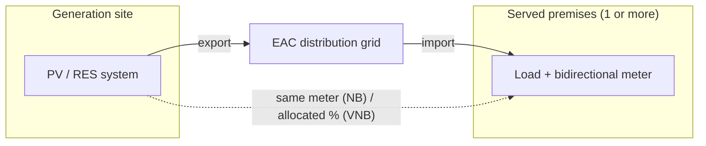

# Cyprus Net Billing & Virtual Net Billing Terms 2026

> **Purpose**: Internal reference for EAC Supply (ΑΗΚ Προμήθεια) **Net Billing** (`Συμψηφισμός Λογαριασμών`) and **Virtual Net Billing** (`Εικονικός Συμψηφισμός Λογαριασμών`) — how exported RES energy is valued, settled and invoiced, plus the DSO sizing and process rules our EPC contracts must reflect.  
> **Audience**: Lighthief project development, EPC, and client proposals. Technical connection rules for BESS remain in [`CyprusDSO.md`](../CyprusDSO.md).

---

## Source documents

| Document | Version / date | Local copy |
|----------|----------------|------------|
| EAC Supply **Net Billing Agreement** (Σύμβαση Συμψηφισμού Λογαριασμών Ηλεκτρικής Ενέργειας), form 9100 | **V6 — 10 Aug 2026** (current) | `L:\My Drive\EAC CERA DOCS\FINAL ΣΥΜΒΑΣΗ ΣΥΜΨΗΦΙΣΜΟΥ ΛΟΓΑΡΙΑΣΜΩΝ AHK ΠΡΟΜΗΘΕΙΑ V6_10-8-2026.pdf` |
| EAC Supply **Virtual Net Billing Agreement** (Σύμβαση Εικονικού Συμψηφισμού Λογαριασμών) | **V.4 — 22 Jul 2026** (current) | `L:\My Drive\EAC CERA DOCS\FINAL ΣΥΜΒΑΣΗ Virtual Net Billing - ΠΡΟΜΗΘΕΙΑ ΑΗΚ_V.4_22-7-26.pdf` |
| EAC Supply Net Billing Agreement | V6 — 23 Mar 2026 (**superseded** by the 10 Aug 2026 text) | `L:\My Drive\EAC CERA DOCS\FINAL ΣΥΜΒΑΣΗ ΣΥΜΨΗΦΙΣΜΟΥ ΛΟΓΑΡΙΑΣΜΩΝ AHK ΠΡΟΜΗΘΕΙΑ V6_23-3-2026.pdf` |
| DSO **Connection Guide for Active Customers and RES Self-Consumers** (Οδηγός Σύνδεσης Ενεργών Πελατών και Αυτοκαταναλωτών) | Edition 2026 (May 2026) | `L:\My Drive\EAC CERA DOCS\connection_guide may 2026.pdf` |
| DSO **RES Technical Guide** (Τεχνικός Οδηγός ΑΠΕ ≤15 MWp) | Edition 2026.1 (May 2026) | `L:\My Drive\EAC CERA DOCS\res_techinical_guide_edition_2026 may 2026.pdf` |

Online: [EAC Net Billing scheme](https://www.eac.com.cy/EL/RegulatedActivities/Supply/renewableenergy/Pages/netbilling.aspx) · [EAC Virtual Net Billing scheme](https://www.eac.com.cy/EL/RegulatedActivities/Supply/renewableenergy/Pages/virtualnetbilling.aspx)

> **Warning — EAC English pages are stale.** The English Virtual Net Billing page still states **150 kWp PV / 500 kWp storage**. The Greek page and the V.4 agreement state **400 kWp / 1 MW**. Always quote the Greek agreement.

**Applicability**: since **1 January 2026** EAC Supply signs only Net Billing or Virtual Net Billing contracts for PV applications lodged with the DSO on or after that date (EAC announcement, 24 Apr 2026). Net Metering is closed to new applicants.

---

## The two schemes at a glance

| | **Net Billing** | **Virtual Net Billing** |
|---|---|---|
| Where the system sits | At the served premises, connected **at the same point as the served meter** (NB §4.4(ii)) | **(a)** At a different location from one or more served premises, **or (b)** in the same building as **at least 2 premises** that share its output (VNB §2.0, §4.4(ii), §7.1) |
| Technology | Any RES system | **PV only** |
| Maximum size | **8 MW** | **400 kWp** per consumption account and per beneficiary/enterprise; **1 MW** per account for systems with energy storage |
| DSO user category (Connection Guide §3) | Category A (same connection point) | Category B (different connection point); shared-building case is Category C (jointly acting self-consumers) |
| Allocation | n/a | **% of PV production** allocated to each served account is stated on the agreement cover page |
| Supply agreement signed when | Connection Terms signed **and** system installed & connected at the served meter | Connection Terms signed |
| Offsetting starts | Connection date, after successful DSO inspection and the **Certificate of Suitability**, which must be presented to EAC Supply (NB §6.2) | Connection date, after successful DSO inspection and the Certificate of Suitability (VNB §6.2) |

All settlement, pricing, invoicing, duration and legal terms below are **identical in both agreements**.

---

## How settlement works (both schemes)

For each **billing period** (monthly or bimonthly, depending on consumer category):

1. **Import** — energy drawn from the grid to the premises.
2. **Export** — energy from the RES system fed into the grid (for VNB, the allocated share).
3. **Offset** — import and export are netted for the period.
4. **Settlement**:
   - **Export ≤ import** → customer pays the difference at the applicable retail tariff.
   - **Export > import** → customer is credited the monetary value of the surplus on the **next** billing period invoice, at the **RES purchase price** (below).

> The DSO Connection Guide (§2) stresses that the offsetting method is a matter **solely between the network user and their Supplier**. The DSO handles connection, protection, metering and telecontrol only.

---

## Export (surplus) price

- Surplus after offset is valued at the **Τιμή Αγοράς Ηλεκτρικής Ενέργειας από ΑΠΕ**, set **monthly** by **EAC Supply**.
- Published per **voltage level** on the EAC website: Regulated Activities → Supply → Renewable Energy Sources → RES Energy Purchase.

> This is **not** net metering (1:1 kWh rollover at retail rate). Surplus is paid at the RES purchase price, which is typically below retail. Our contracts may say "may be materially below"; the agreements themselves do not quantify it.

### Annual clearing — surplus forfeiture

| Metering cycle | Final clearing month |
|----------------|---------------------|
| Bimonthly read | **October** or **November** (per read schedule) |
| Monthly read | **November** |

The clearing period may be changed by a CERA or EAC Supply decision.

**Any monetary surplus left after the final clearing is written off without compensation.** The same write-off applies on:

- termination of supply to the premises
- expiry of the agreement
- **change of Supplier**
- cessation of operation of the served premises

**Planning implication**: size PV so the annual export surplus is minimised. Do not present net billing as a long-term export revenue stream.

---

## Invoicing (§7.2–7.4)

| Situation | Invoices |
|-----------|----------|
| **Export > import** | **Two invoices**: (1) all import charges, with the total export credit deducted at the bottom; (2) a **self-billing** invoice (`αυτοτιμολόγηση`) detailing the credit |
| **Import > export** | One invoice, import charges only |

- The credit is shown separately from import charges per **CERA Decision 28/2020**, together with VAT and other applicable levies.
- **Domestic tariff code 08**: charges per **CERA Decision 16/2019** instead of 28/2020, unless CERA decides otherwise.

The producer also pays all charges set by CERA (network, ancillary, etc.) — §7.1.

---

## Signing preconditions (§4.4) — what changed in 2026

| | NB V6 — 23 Mar 2026 (superseded) | **NB V6 — 10 Aug 2026** | **VNB V.4 — 22 Jul 2026** |
|---|---|---|---|
| Signed DSO Connection & Operation Terms presented | ✔ (and Declaration of Acceptance) | ✔ | ✔ |
| System installed & connected at the served meter | — | ✔ | — (instead: off-site, or shared building with ≥2 premises) |
| DSO inspection passed + Certificate of Suitability | **✔ before signing** | ✘ (needed before offsetting starts, §6.2) | ✘ (needed before offsetting starts, §6.2) |
| CERA operating licence / exemption / general licence | ✔ before signing | not listed in §4.4 or §6.2 | not listed in §4.4 or §6.2 |

**Practical effect**: the supply agreement is now signed **before** the DSO inspection, which aligns with the DSO Connection Guide §5.7–5.8: an inspection request is only accepted with a signed supply contract attached. CERA still requires a licence, general licence or exemption where applicable (Connection Guide §5.1 and §5.11).

---

## DSO sizing rules (Connection Guide 2026 §4, Technical Guide 2026.1 Annex 4)

### Maximum installed capacity (non-saturated network)

The maximum is set by the **load entitlement (fuse)** of the served premises.

**Fuse up to 3×40 A**:

| Fuse | Max PV without storage (kW) | Max PV with storage, or permanent zero export (kW) |
|------|-----------------------------|----------------------------------------------------|
| 1×20 A (1-ph) | 4.16 | 4.16 |
| 1×30 A (1-ph) | 4.16 | 5.2 |
| 1×40 A (1-ph) | 4.16 | 5.2 |
| 3×20 A (3-ph) | 6 | 10.4 |
| 3×30 A (3-ph) | 8 | 10.4 |
| 3×40 A (3-ph) | 10.4 | 10.4 |

**Fuse above 3×40 A**: max **80%** of load entitlement, rising to **100%** with storage or permanent zero export (e.g. 3×50 A → 27.7 / 34.6 kW; 3×80 A → 44.4 / 55.5 kW; 3×200 A → 110.9 / 138.6 kW).

- The "with storage" uplift requires storage capacity in **kWh ≥ installed PV kW**.
- In **saturated** network areas (see the EAC hosting-capacity map), systems up to these limits are allowed only under **permanent zero export**.
- For jointly acting self-consumers in one building, the limit is the **sum** of the individual premises' limits.

### As-built tolerance vs approved capacity

| System | Allowed over approved capacity |
|--------|-------------------------------|
| 1-ph ≤ 10.4 kW | +6%, capped at **4.24 kW** (5.2 kW with storage; 1×20 A stays at 4.24 kW) |
| 1-ph PV on a 3-ph supply | approved max 2 kW, installed max **2.12 kW**, inverter max 3.3 kVA (the Connection Guide says 2.2 kW; the Technical Guide is stricter) |
| 3-ph ≤ 10.4 kW | +6%, capped at **6.36 kW** (3×20 A), **8.48 kW** (3×30 A), **10.4 kW** (3×40 A) |
| > 10.4 kW | **+2 kW** |

- **No lower limit** — the lower deviation limit has been abolished.
- Exceeding the maximum is **illegal**: the DSO disconnects immediately and notifies the Electrical & Mechanical Services Department.
- The applicant must **notify their Supplier** when the installed capacity differs from the approved capacity (within tolerance).
- Any capacity or storage increase, or export-limit change, without DSO approval voids the Connection Terms and requires a fresh application (Connection Guide §4.7).

### Inverter sizing

| System | Minimum total inverter kVA | Maximum total inverter kVA |
|--------|---------------------------|---------------------------|
| ≤ 10.4 kW | up to 10% below installed PV kW | up to 2 kVA above installed PV kW; caps: 1-ph **5 kVA** (hybrid **5.5 kVA** if PV > 4 kW with storage), 3-ph **11 kVA**, 1-ph inverter on 3-ph supply **3.3 kVA** |
| > 10.4 kW | the **greater** of 0.94 × P and P − 250 kVA | the **smaller** of P / 0.9 and P + 250 kVA |

- A **three-phase inverter** is required above 4.16 kW.
- Total inverter capacity must never exceed the premises' load entitlement.
- The simple 0.94×–1.111× band only holds up to about **2.25 MW**. Above that, the +250 kVA ceiling applies, and above about 4.17 MW the −250 kVA floor applies.

### Storage with PV (Connection Guide §4.5)

- Storage may only increase self-consumption: it **must not import from or export to the grid**.
- AC-coupled storage inverter ≤ PV rated power, and storage inverter + PV inverter ≤ load entitlement (otherwise protection must cap total export at the PV installed capacity).
- PV and storage must share the same connection line, main export breaker, contactor, relay protection, production meter and export-control device.

### Metering

- A **bidirectional meter** is mandatory on all systems (or two meters if not feasible).
- A **production meter** is also required above **10.4 kW**.
- **Virtual Net Billing**: a separate production meter for each RES system per served account.

---

## Process and deadlines (Connection Guide 2026 §5)

1. **Permits before applying**: CERA licence / general licence / exemption (see below) and a **building permit** or documented exemption where the Streets & Buildings Law applies.
2. **DSO application** with Annex B documents: recent bill of the served premises (**applicant must be the bill holder** — transfer the account first if needed); site plan; CE declarations; title deed of the installation plot (for VNB also the served premises); topographic plan ≤ 6 months old (for VNB, of the installation plot); civil engineer's roof certificate (ETEK); ID or company directors' certificate; electrical engineer's confirmation of meter-cabinet space for the ripple-control receiver; installer competence certificate (PV ≤ 30 kW).
3. **DSO decision**: approval with Connection & Operation Terms, or reasoned rejection based on network constraints, following the priority order.
4. **Client signs the Terms and pays the connection contribution.**
5. **Build deadline from DSO approval** — otherwise the approval **lapses** and a new application is required:
   - **60 working days** (standard case)
   - **6 calendar months** for systems **> 10.4 kW**, or new houses applying for connection at the same time
   - **12 months** where a network extension is needed
6. **Supply contract** with a Supplier or aggregator (the NB/VNB agreement above) must be in place before the inspection request.
7. **Inspection request** with the supply contract → DSO installs its equipment → DSO inspection → Certificate of Suitability.
8. **CERA operating licence / exemption**, where applicable, after the successful inspection.
9. **DSO energises the system.**

### CERA licensing route (N.130(I)/2021 art. 27, 49; Κ.Δ.Π. 290/2025)

| System | Route |
|--------|-------|
| ≤ 10.8 kW self-consumption | Simple notification to the DSO |
| ≤ 50 kW self-consumption | **General Licence** via notification to CERA (no fee for self-consumption) |
| PV on the shell of an existing building, > 50 kW | **General Licence** (not an exemption) |
| Other RES (e.g. ground-mount) > 50 kW up to 8 MW | **Exemption** from licence (construction & operation) |
| > 8 MW | Full licence |

---

## Supply agreement: duration and legal terms

| Topic | Summary |
|-------|---------|
| **Duration** (§6.1) | **1 year** from signature, **auto-renewing** unless either party gives **30 days'** written notice before expiry |
| **Operation** (§5) | Per Grid Codes, the signed DSO Connection Terms and the Technical Guide |
| **Hierarchy** (§4.3) | Transmission/Distribution Rules prevail over the agreement unless it states otherwise |
| **Amendments** (§10.1) | EAC Supply may amend by prior notice on its website or by other means |
| **Breach** (§11) | 15 days to remedy; 60 days' consultation, then CERA |
| **Licence loss** (§9, §12) | Rights cease and the agreement terminates automatically if the CERA licence/exemption is withdrawn |
| **Producer termination** (§13.2) | 30 days' notice + compensation per §15 |
| **Assignment** (§14) | **Prohibited** without EAC Supply's written consent; breach → termination and possible DSO disconnection |
| **Liability** (§15) | Producer liable for damage it or its contractors cause to the network, consumers or others |
| **Force majeure** (§8) | Delay only, no compensation; subcontractor or supplier default is not force majeure |
| **Disputes** (§16) | Amicable → CERA arbitration (by agreement) → Cyprus courts |
| **Language** (§2.2) | Greek governs |
| **Signature** | Signed **before two witnesses** |
| **GDPR** (§18) | EAC Supply is controller |

---

## Relationship to BESS (see CyprusDSO.md)

> The BESS categories below are the **Storage Technical Guide** categories and are different from the Connection Guide user categories A–D used above.

| BESS category | Net billing relevance |
|---------------|----------------------|
| **Category A** (self-consumption) | Same premises/meter; storage charges from RES only, **no grid exchange**; offsetting applies to RES import/export only |
| **Category B** (hybrid, BESS ≤ RES) | RES may export per dispatch; BESS cannot charge from grid |
| **Category C** (standalone storage) | Separate licensing and metering; not covered by the NB/VNB supply agreements |

For utility-scale parks, settlement may additionally involve **market participation** (competitive market from 1 Oct 2025 per CERA 02/2024) — confirm per project licence type.

---

## Checklist for new clients

- [ ] Scheme chosen: **NB** (at the served meter) or **VNB** (off-site, or shared building with ≥2 premises)
- [ ] Capacity within the fuse/load-entitlement limit (and ≤ 8 MW NB, ≤ 400 kWp / 1 MW with storage VNB)
- [ ] Applicant is the bill holder of every served account (transfer first if not)
- [ ] VNB: allocation % per served account agreed; plot owner consent secured
- [ ] Shared building: 75% owners' consent for common areas; responsible representative appointed (forms E-ΔΔ-801/802)
- [ ] CERA route and building-permit position confirmed before the DSO application
- [ ] DSO Terms signed and contribution paid; **build deadline** diarised (60 working days / 6 months / 12 months)
- [ ] NB/VNB supply agreement signed before the inspection request
- [ ] Inspection passed; **Certificate of Suitability** sent to EAC Supply
- [ ] Tariff category confirmed (code **08** → Decision 16/2019)
- [ ] Annual surplus write-off (Oct/Nov) explained to client
- [ ] If storage: no grid charging or discharging; confirm category and protection design

---

## Revision history

| Date | Version | Changes |
|------|---------|---------|
| 2026-05-19 | 1.0 | Initial README derived from EAC Supply Net Billing Agreement **V6** (23 Mar 2026) |
| 2026-09-23 | 2.0 | Updated to NB V6 **10 Aug 2026** (new §4.4 signing preconditions; §6.2 certificate to EAC Supply; tolerance in title) and added **Virtual Net Billing V.4 (22 Jul 2026)**. Added DSO Connection Guide 2026 / Technical Guide 2026.1 sizing, inverter, storage, metering, deadline and CERA licensing rules. Flagged stale EAC English VNB page. |
