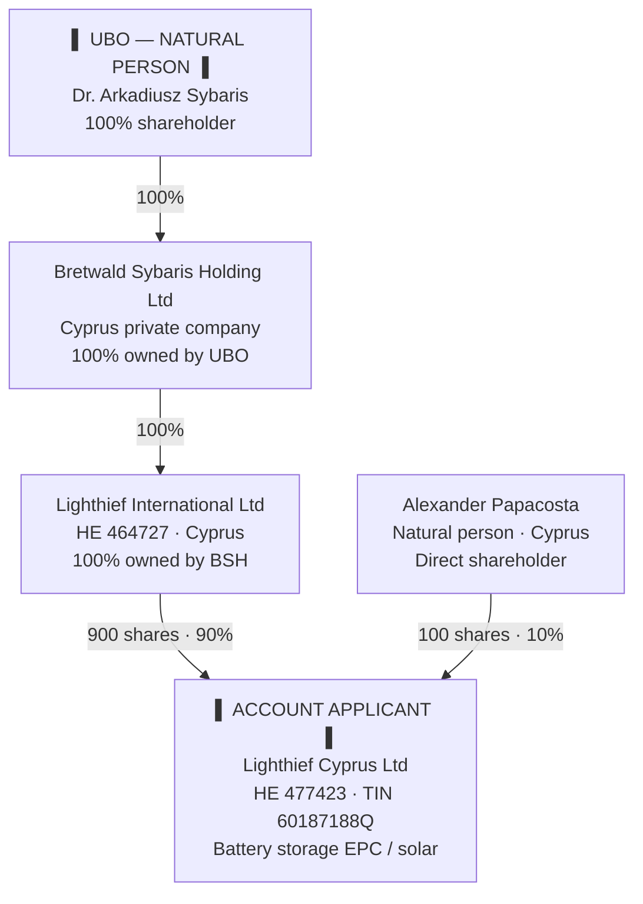

# Group ownership structure — bank KYC

**Document:** LCY-KYC-STRUCT-2026-001  
**Date:** 30 June 2026  
**Purpose:** Ultimate beneficial owner (UBO) and corporate structure chart for **Revolut Business** and **Bank of Cyprus** KYC / onboarding  
**Account applicant:** Lighthief Cyprus Ltd (HE 477423)

**Attach with this chart:** Current ROC extracts (LCY, LI, BSH); director & shareholder certificates; TIN / VAT evidence; proof of registered & operating address.  
**Registrar PDFs:** [`../reg docs/`](../reg%20docs/README.md)

**Print to PDF:** Open [KYC-GROUP-STRUCTURE-BANKS.html](./KYC-GROUP-STRUCTURE-BANKS.html) in a browser → Print → Save as PDF.

---

## 1. Ownership structure chart (UBO at top)



### Effective ownership of Lighthief Cyprus Ltd

| Person / entity | Route | Effective % of LCY |
|-----------------|-------|------------------:|
| **Dr. Arkadiusz Sybaris** (UBO) | 100% BSH → 100% LI → 90% LCY | **90%** |
| **Alexander Papacosta** | Direct shareholder | **10%** |

**UBO declaration:** Dr. Arkadiusz Sybaris is the **ultimate beneficial owner** of Lighthief Cyprus Ltd through his **100% ownership of Bretwald Sybaris Holding Ltd**, which owns **100% of Lighthief International Ltd**, which owns **90%** of Lighthief Cyprus Ltd. Alexander Papacosta holds **10%** directly and is a **shareholder and director** but not the UBO of the group.

---

## 2. Entity register (Cyprus — relevant to KYC)

| # | Entity name | Reg. no. | Jurisdiction | Role | Owned by | Ownership % |
|---|-------------|----------|--------------|------|----------|------------:|
| — | **Dr. Arkadiusz Sybaris** | — | Natural person | **UBO** | — | 100% of BSH |
| 1 | **Bretwald Sybaris Holding Ltd** | *[HE no. from ROC extract]* | Cyprus | Top holding company | Dr. Arkadiusz Sybaris | 100% |
| 2 | **Lighthief International Ltd** | HE 464727 | Cyprus | Intermediate holding; 90% shareholder of LCY | Bretwald Sybaris Holding Ltd | 100% |
| 3 | **Lighthief Cyprus Ltd** | HE 477423 | Cyprus | **Operating company / bank account holder** | LI 90% · A. Papacosta 10% | — |

---

## 3. Lighthief Cyprus Ltd — account applicant details

| Field | Detail |
|-------|--------|
| **Legal name** | Lighthief Cyprus Ltd |
| **Company number** | HE 477423 |
| **TIN** | 60187188Q |
| **Registered office** | Agiou Andreou 241, AG TRIAS COURT, Flat/Office 31, 3036 Limassol, Cyprus |
| **Operating address** | 28 October Ave 249, Lophitis Business Center 1, Office 201, 3035 Limassol, Cyprus |
| **Website** | solarfarms.cy |
| **Email** | office@lighthief.com |
| **Phone** | +357 77 77 00 50 |
| **Business activity** | EPC contractor for battery energy storage systems (BESS) and solar PV; operations & maintenance (LTSA) |
| **Issued share capital** | 1,000 ordinary shares |

### Share register (Lighthief Cyprus Ltd)

| Shareholder | Shares | % | Type |
|-------------|-------:|--:|------|
| Lighthief International Ltd (HE 464727) | 900 | 90% | Legal entity |
| Alexander Papacosta | 100 | 10% | Natural person |

### Directors & secretary (Lighthief Cyprus Ltd)

| Name | Role | Appointed |
|------|------|-----------|
| **Alexander Papacosta** | Director | 29 June 2026 |
| **Alexander Papacosta** | Company Secretary | 29 June 2026 |
| Lighthief International Ltd | Corporate director *(if on register — confirm ROC extract)* | Represented by **Dr. Arkadiusz Sybaris** |

**Authorised bank signatories:** As per board resolution and bank mandate *(to be completed on onboarding)*.

---

## 4. UBO — natural person (for bank UBO form)

| Field | Detail |
|-------|--------|
| **Full name** | Dr. Arkadiusz Sybaris |
| **Capacity** | Ultimate beneficial owner |
| **Basis of UBO status** | 100% shareholder of **Bretwald Sybaris Holding Ltd** |
| **Effective interest in LCY** | **90%** (indirect via BSH → LI → LCY) |
| **Also** | Director of **Sybaris Capital Investments Ltd** (HE 321056); authorised signatory for Lighthief International Ltd |

*Provide with bank application: passport / ID, proof of address, and CV / LinkedIn if requested.*

---

## 5. Other disclosed person — 10% shareholder (not UBO)

| Field | Detail |
|-------|--------|
| **Full name** | Alexander Papacosta |
| **Capacity** | 10% shareholder; Director & Secretary of Lighthief Cyprus Ltd |
| **Email / phone** | office@lighthief.com · +357 99 164 158 |
| **UBO?** | No — below typical 25% UBO threshold; disclosed as **direct shareholder and executive director** |

---

## 6. Simplified linear chain (for bank PDF upload)

```
Dr. Arkadiusz Sybaris (UBO)
        │ 100%
        ▼
Bretwald Sybaris Holding Ltd
        │ 100%
        ▼
Lighthief International Ltd (HE 464727)
        │ 90%                              Alexander Papacosta ── 10%
        ▼                                              │
Lighthief Cyprus Ltd (HE 477423) ◄─────────────────────┘
        ACCOUNT APPLICANT — Revolut / Bank of Cyprus
```

---

## 7. Related group entities (not account holders — disclosure only)

| Entity | Reg. no. | Relationship | Note |
|--------|----------|--------------|------|
| Sybaris Capital Investments Ltd | HE 321056 | Sybaris investment vehicle | Same operational address; not in LCY ownership chain |
| Lighthief Sp. z o.o. | KRS 0000498790 | Poland operating subsidiary / associate | LI holds 24% — separate jurisdiction |
| Bretwald Ltd | — | Legacy shareholder of Polish opco (24%) | Related name to BSH — separate legal entity |

*Banks may ask whether the applicant controls foreign entities — answer: **Lighthief International Ltd** holds minority stakes abroad; **Lighthief Cyprus Ltd** is the Cyprus operating company.*

---

## 8. Documents to submit with this chart

| Document | Entity | Status |
|----------|--------|--------|
| Certificate of shareholders | Lighthief Cyprus Ltd | **Available** — 16 Jun 2026 · [`reg docs/doc12710520260616075738.pdf`](../reg%20docs/doc12710520260616075738.pdf) |
| Certificate of directors & secretary | Lighthief Cyprus Ltd | **Available** — 29 Jun 2026 · [`reg docs/Director Certificate…pdf`](../reg%20docs/Director%20Certificate%20Lighthief%20Cyprus%20Ltd%20doc12173520260310075222.pdf) |
| HE32 — director/secretary changes | Lighthief Cyprus Ltd | **Available** — 29 Jun 2026 · [`reg docs/doc127956…_001–004.pdf`](../reg%20docs/README.md) |
| Pandaserve invoice (LCY filing) | Lighthief Cyprus Ltd | **On file** — 26 Feb 2026 · [`reg docs/260742.pdf`](../reg%20docs/260742.pdf) |
| ROC extract (recent) | Lighthief Cyprus Ltd HE 477423 | Optional — certs above usually sufficient |
| ROC extract | Lighthief International Ltd HE 464727 | **Pending** — invoice only · [`reg docs/262455.pdf`](../reg%20docs/262455.pdf) |
| ROC extract | Bretwald Sybaris Holding Ltd | **Pending** — invoice only · [`reg docs/262457.pdf`](../reg%20docs/262457.pdf) |
| Register of members | BSH, LI, LCY | Obtain current |
| TIN certificate | LCY 60187188Q | Obtain if required |
| Proof of operating address | 28 October Ave 249, Limassol | Utility bill / lease |
| Board resolution — bank account opening | LCY | Board to adopt |
| UBO declaration form | Signed by director | Per bank template |

---

## 9. Bank-specific notes

### Revolut Business
- Upload **Section 6** linear chart or export Mermaid as PDF.
- Declare **Dr. Arkadiusz Sybaris** as UBO with **90% effective ownership** of the applicant.
- List **Alexander Papacosta** as director and **10% shareholder**.
- Business category: **Construction / renewable energy / EPC** or closest match.

### Bank of Cyprus
- Request **corporate account — Cyprus Ltd** onboarding pack.
- Provide **group structure chart** (this document) with **UBO at top**.
- Expect **dual signatory** mandate; typical KYC on both UBO and authorised signatories.
- TIN **60187188Q** and HE **477423** on all forms.

---

## 10. Declaration

This structure chart reflects the **beneficial ownership position as confirmed internally on 30 June 2026**:

1. **Dr. Arkadiusz Sybaris** — 100% shareholder of **Bretwald Sybaris Holding Ltd**  
2. **Bretwald Sybaris Holding Ltd** — 100% shareholder of **Lighthief International Ltd**  
3. **Lighthief International Ltd** — 900 shares (**90%**) of **Lighthief Cyprus Ltd**  
4. **Alexander Papacosta** — 100 shares (**10%**) of **Lighthief Cyprus Ltd**

Certified by: _____________________________  
**Alexander Papacosta**, Director & Secretary  
Lighthief Cyprus Ltd  
Date: _____________________________

---

*Internal reference — attach current ROC extracts before submission. Not legal advice.*
