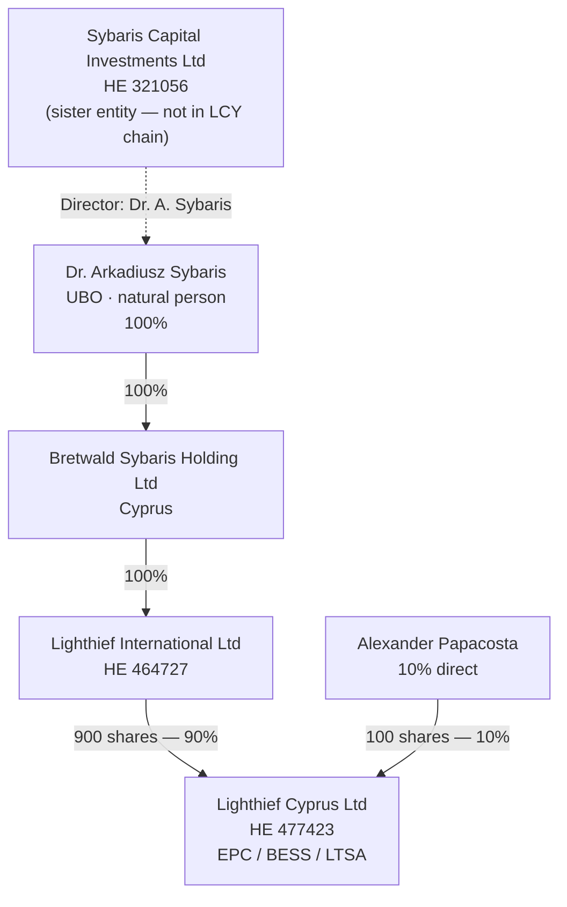
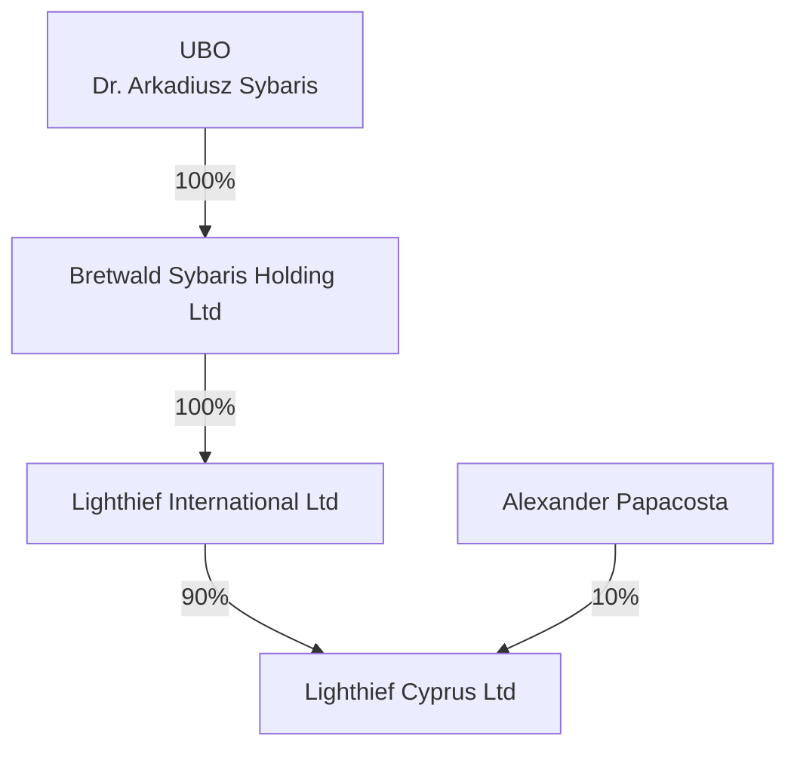
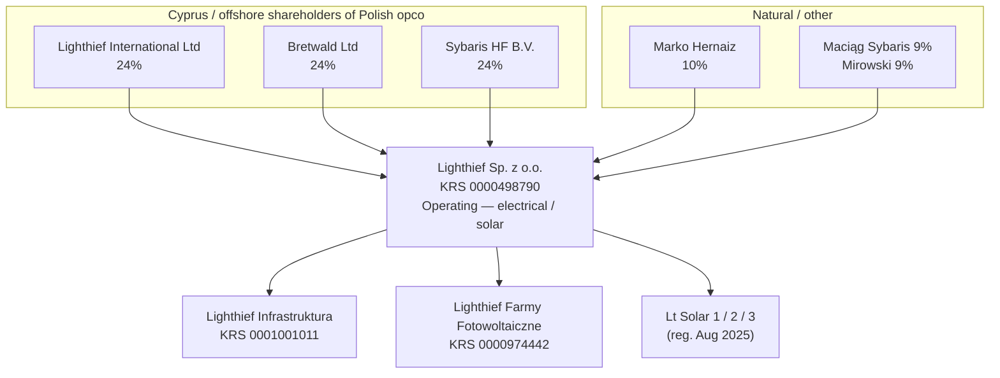
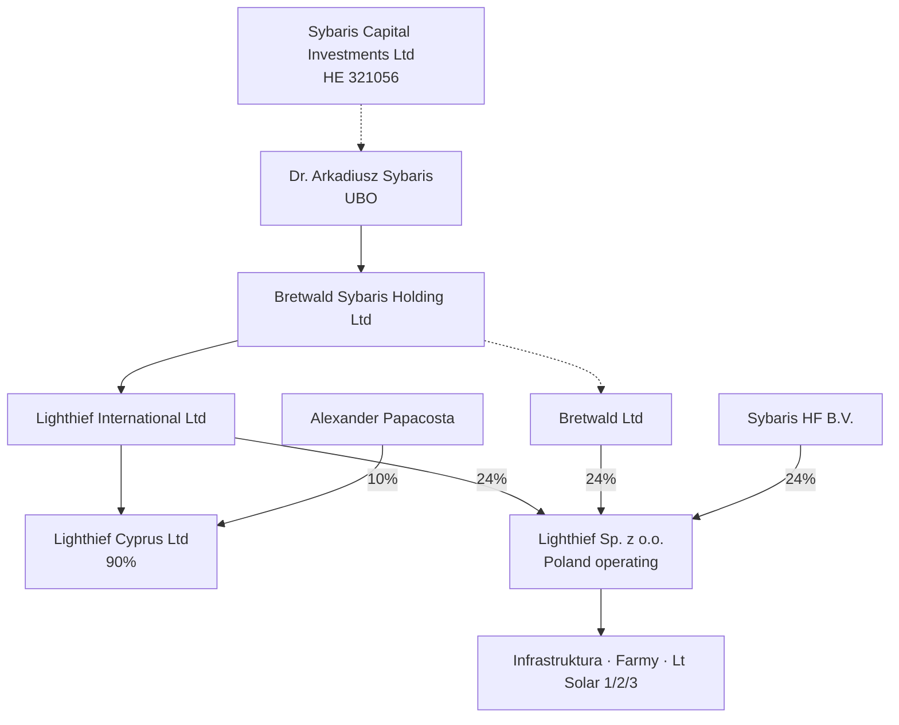

# Company structure — Lighthief group (Cyprus & Poland)

**Document:** LCY-GOV-STRUCT-2026-003  
**Date:** 30 June 2026  
**Status:** Working draft — UBO and ownership chain confirmed; attach ROC extracts for bank submission  

**Bank KYC chart:** [KYC-GROUP-STRUCTURE-BANKS.md](./KYC-GROUP-STRUCTURE-BANKS.md) · **[Print-ready HTML](./KYC-GROUP-STRUCTURE-BANKS.html)** (Revolut · Bank of Cyprus)

**Sources:** Shareholder certificate (LCY); HE32 forms filed 29 Jun 2026 (Pandaserve); director certificate 10 Mar 2026; Polish KRS / e-Sprawozdania 2022–2024

---

## 1. Legal entity (Cyprus operating company)

| Item | Detail |
|------|--------|
| **Name** | Lighthief Cyprus Ltd |
| **Reg. No.** | HE 477423 |
| **TIN** | 60187188Q |
| **Registered office** | Agiou Andreou 241, AG TRIAS COURT, Flat/Office 31, 3036 Limassol, Cyprus |
| **Principal place of business** | 28 October Ave 249, Lophitis Business Center 1, Office 201, 3035 Limassol, Cyprus |
| **Website** | solarfarms.cy |
| **General contact** | office@lighthief.com · +357 77 77 00 50 |
| **Role** | Cyprus EPC / BESS / LTSA operating company |

---

## 2. Share register — Lighthief Cyprus Ltd

**Issued share capital:** 1,000 ordinary shares (per shareholder certificate)

| Shareholder | Shares | % | Legal form |
|-------------|-------:|--:|------------|
| **Lighthief International Ltd** (HE 464727) | 900 | **90%** | Cypriot / foreign holding co. |
| **Alexander Papacosta** | 100 | **10%** | Natural person |

**Effective economic control:** 90% via **Dr. Arkadiusz Sybaris (100% BSH) → Bretwald Sybaris Holding Ltd (100% LI) → Lighthief International Ltd (90% LCY)**; 10% direct to Alexander Papacosta.

**UBO:** **Dr. Arkadiusz Sybaris** — 100% shareholder of Bretwald Sybaris Holding Ltd (**90% effective interest in LCY**).

> **Counsel:** Confirm name on certificate matches ID (Alexander Papacosta). Attach current ROC shareholder extract to data room.

---

## 3. Group structure — Cyprus (confirmed / near-confirmed)

### 3.1 Overview diagram

### 3.2 Control chain (UBO → operating company)

| Layer | Entity | Holds | Effective % of LCY |
|-------|--------|-------|-------------------:|
| **UBO** | **Dr. Arkadiusz Sybaris** | 100% of Bretwald Sybaris Holding Ltd | **90%** (indirect) |
| 1 | Bretwald Sybaris Holding Ltd | 100% of Lighthief International Ltd | — |
| 2 | Lighthief International Ltd | 90% of Lighthief Cyprus Ltd (900 shares) | **90%** |
| — | Alexander Papacosta (direct) | 10% of Lighthief Cyprus Ltd (100 shares) | **10%** |

### 3.3 Related Cyprus entities

| Entity | Reg. No. | Address / notes | Key officers (Jun 2026) |
|--------|----------|-----------------|-------------------------|
| **Lighthief International Ltd** | HE 464727 | — | Parent of LCY (90%); also 24% shareholder of Polish opco |
| **Bretwald Sybaris Holding Ltd** | *[HE from ROC extract]* | Cyprus holding co. | **100% owned by Dr. Arkadiusz Sybaris**; 100% parent of LI |
| **Sybaris Capital Investments Ltd** | HE 321056 | 28 Oct Ave 249, Office 201, Limassol | **Director & Secretary:** Dr. Arkadius Sybaris (from 29 Jun 2026) |

**Corporate services:** Pandaserve Ltd, Limassol (Registrar e-filing invoices 262455, 262457, Jun 2026).

---

## 4. Group structure — Poland (operating & SPVs)

| Entity | KRS | Role | 2024 snapshot |
|--------|-----|------|----------------|
| **Lighthief Sp. z o.o.** | 0000498790 | Poland operating company | ~3.5M PLN revenue; ~6.3M PLN assets |
| **Lighthief Infrastruktura Sp. z o.o.** | 0001001011 | Infra SPV | Dormant (~50k PLN) |
| **Lighthief Farmy Fotowoltaiczne Sp. z o.o.** | 0000974442 | PV farm SPV | Dormant (~99k PLN); Lighthief Sp. z o.o. holds 20% |
| **Lt Solar 1 / 2 / 3 Sp. z o.o.** | 0001187177 et al. | Solar project SPVs | Registered Aug 2025; no financials yet |

**Note:** Polish opco shareholding is **separate** from the LCY cap table. Lighthief International Ltd appears in both structures (90% of LCY; 24% of Poland).

---

## 5. Full group diagram (Cyprus + Poland)

---

## 6. Directors, secretary & signing (LCY)

### 6.1 Current officers — Lighthief Cyprus Ltd

| Role | Name | Effective | Source |
|------|------|-----------|--------|
| **Director** | Alexander Papacosta | 29 Jun 2026 | HE32 filed with Registrar |
| **Secretary** | Alexander Papacosta | 29 Jun 2026 | HE32 filed with Registrar |
| **Former director / secretary** | Panayiotos Christodoulou | Resigned 29 Jun 2026 | HE32 (nominee / corporate services) |

**Prior director certificate:** Alexander Papacosta listed as sole director (certificate dated 10 Mar 2026).

**Corporate director (if still on register):** Lighthief International Ltd — confirm authorised representative(s) on current ROC extract. Internal governance assumes **Dr. Arkadius Sybaris** represents LI at board level until extract confirms otherwise.

### 6.2 Signing logic (summary)

| Action | Who signs |
|--------|-----------|
| **LCY commercial contracts** (EPC, supply, LTSA) | **Alexander Papacosta** as Director (within board / SHR authority) |
| **Shareholder resolution — LI’s 90% block** | Authorised signatory for **Lighthief International Ltd** (typically Dr. A. Sybaris) |
| **Shareholder resolution — Alexander’s 10%** | **Alexander Papacosta** as shareholder |
| **Unanimous / 100% written shareholder consent** | **Both** LI and Alexander Papacosta |
| **Statutory ordinary / special resolution (>75%)** | **LI alone sufficient** at 90% — confirm articles & any SHA |
| **UBO personal undertakings / Founder side letters** | **Dr. Arkadius Sybaris** (personal capacity) |

Full matrix: [DRAFT-SIGNING-MATRIX-AND-GOVERNANCE.md](../../Alexander/DRAFT-SIGNING-MATRIX-AND-GOVERNANCE.md)

---

## 7. Governance documents to maintain

| Document | Purpose | Owner |
|----------|---------|--------|
| Certificate of incorporation & articles | Constitutional rules | Company secretary / counsel |
| **Register of members** | 900 / 100 split | Company secretary |
| Register of directors | Statutory compliance | Company secretary |
| ROC extracts (LCY, LI, BSH) | Bank KYC / investor diligence | Company secretary |
| Board minutes / written resolutions | Decision audit trail | Chair / secretary |
| Bank mandate | Payment signatories | Board + bank |
| Delegated authority matrix | Contract limits | Board |
| Shareholders’ agreement (if any) | Reserved matters, 10% protections | Counsel |
| D&O insurance | Director risk | Board |

---

## 8. Signing & commitment policy (summary)

| Category | Typical control |
|----------|-----------------|
| **Bank:** routine operations | Per **bank mandate** |
| **Contracts:** EPC / supply / large subcontract | Dual signatory or MD + board above agreed € thresholds |
| **Parent guarantees / bonds / APG** | Board resolution + named signatories |
| **Employment / remuneration** | Board-approved budget; shareholder resolution where required |
| **Share transfers / equity** | Per articles + any SHA; LI and Alexander as applicable |

Draft resolutions: [BOARD-RESOLUTION-signing-authority-DRAFT.md](./BOARD-RESOLUTION-signing-authority-DRAFT.md)

---

## 9. Data room checklist

- [x] **LCY cap table** — 900 LI / 100 Alexander Papacosta (shareholder certificate)
- [x] **LCY director / secretary** — Alexander Papacosta (HE32, 29 Jun 2026)
- [ ] **ROC extract** — Lighthief Cyprus Ltd (HE 477423) — post–Jun 2026
- [ ] **ROC extract** — Lighthief International Ltd (HE 464727)
- [x] **UBO chain confirmed** — Dr. Arkadiusz Sybaris → 100% BSH → 100% LI → 90% LCY
- [ ] **ROC extract** — Bretwald Sybaris Holding Ltd (attach to bank KYC)
- [ ] **Register of members** — BSH, LI, LCY
- [ ] **Bank mandate** aligned with board resolution
- [ ] **Signed** board resolutions (signing matrix + budget)
- [ ] **D&O** policy schedule
- [ ] **Polish financials** — Lighthief Sp. z o.o. 2022–2024 (in `lighthief-poland/financials/`)
- [ ] **Shareholders’ agreement** (if exists) covering 10% minority rights

---

## 10. Document history

| Date | Change |
|------|--------|
| 15 May 2026 | LCY-GOV-STRUCT-2026-001 — placeholder structure |
| 29 Jun 2026 | HE32: Christodoulou out; Papacosta director/secretary LCY; Sybaris director/secretary Sybaris Capital |
| 29 Jun 2026 | Registrar filings: Lighthief International Ltd; Bretwald Sybaris Holding Ltd |
| 30 Jun 2026 | LCY-GOV-STRUCT-2026-002 — cap table 90/10; BSH → LI → LCY chain; Poland group added |
| 30 Jun 2026 | LCY-GOV-STRUCT-2026-003 — UBO confirmed: Sybaris 100% BSH; bank KYC chart added |

---

## 11. Disclaimer

This pack is an **internal working document**. It does not create legal rights or obligations until verified by **Cyprus-qualified counsel** against current ROC extracts, the articles of association, and any shareholders’ agreement. **Do not** present as final to banks or investors without counsel sign-off.
