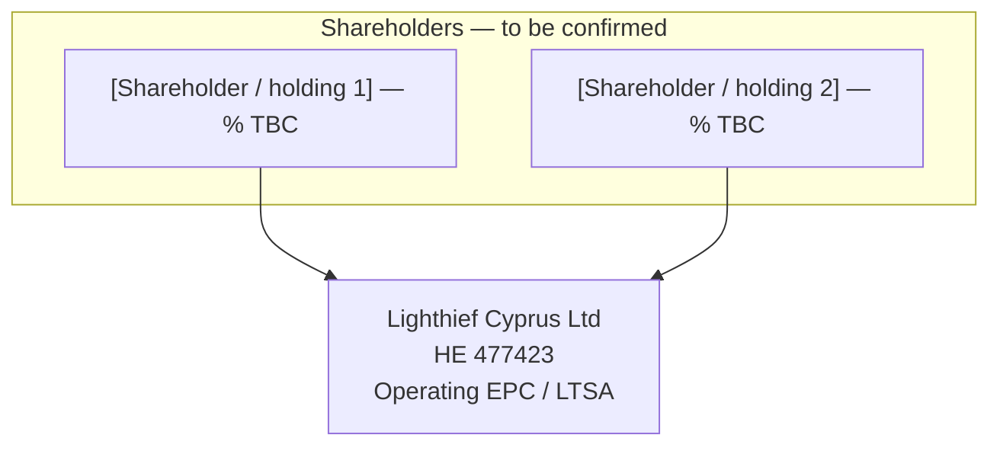

# Company structure — Lighthief Cyprus Ltd

**Document:** LCY-GOV-STRUCT-2026-001  
**Date:** 15 May 2026  
**Status:** DRAFT — for bank & investor readiness (counsel to finalise)

---

## 1. Legal entity (operating company)

| Item | Detail |
|------|--------|
| **Name** | Lighthief Cyprus Ltd |
| **Reg. No.** | HE 477423 |
| **TIN** | 60187188Q |
| **Registered office** | Agiou Andreou 241, AG TRIAS COURT, Flat/Office 31, 3036 Limassol, Cyprus |
| **Principal place of business** | 28 October Ave 249, Lophitis Business Center 1, Office 201, 3035 Limassol, Cyprus |
| **Website** | solarfarms.cy |
| **General contact** | office@lighthief.com · +357 77 77 00 50 |

---

## 2. Intended group structure (placeholder)

*Counsel to confirm against current Registrar extract and share register.*

**Notes for completion**

- Insert **exact shareholder names**, **legal form** (natural / Cypriot or foreign holding), and **%** when cap table is finalised.
- If a **holding company** is a shareholder, attach a **corporate structure chart** (one page PDF) for the bank.

---

## 3. Board of directors (placeholder)

| # | Director | Capacity | Appointed by | Notes |
|---|----------|----------|--------------|--------|
| 1 | `[Name]` | Natural person | `[Ordinary / shareholder resolution date]` | `[e.g. Cyprus operations lead]` |
| 2 | `[Name or corporate director]` | `[Natural / corporate]` | `[resolution date]` | `[e.g. founder side via [Holding Ltd]]` |

**Corporate director:** If a **company** is listed as director, record the **authorised representative(s)** / alternate(s) filed at the Registrar and attach evidence.

**Quorum & casting vote:** To be taken from **articles of association** — do not invent here; counsel fills in.

---

## 4. Governance documents the company should maintain

| Document | Purpose | Owner |
|----------|---------|--------|
| Certificate of incorporation & constitutional docs | Proof of existence & rules | Company secretary / counsel |
| Register of members | Ownership | Company secretary |
| Register of directors | Statutory compliance | Company secretary |
| Board minutes / written resolutions | Evidence of decisions | Chair / company secretary |
| Bank mandate card | Who signs payments | Board + bank |
| Delegated authority matrix | Who signs contracts & up to what € | Board |
| Approved annual / project budget | Liquidity & payroll discipline | Board |
| D&O insurance policy | Director risk mitigation | Board |

---

## 5. Signing & commitment policy (summary — to be enacted by board resolution)

*Numbers are illustrative defaults for discussion; counsel and the board set final thresholds.*

| Category | Typical control |
|----------|-----------------|
| **Bank:** routine operations | As per **bank mandate** (often two signatories above €[X]) |
| **Contracts:** EPC / supply / large subcontract | **Dual signatory** or **MD + chair** above €[Y]; counsel review above €[Z] |
| **Parent company guarantees / bonds / APG** | **Board resolution** + named signatories only |
| **Employment / remuneration** | Board-approved budget + single HR signatory within band |
| **Litigation settlement** | Board resolution |

Full wording: see [BOARD-RESOLUTION-signing-authority-DRAFT.md](./BOARD-RESOLUTION-signing-authority-DRAFT.md).

---

## 6. Budget & capital discipline (summary)

The board should approve a **written 90-day (or 12-month) cash budget** including at minimum: payroll + social insurance, rent, marketing, legal, insurance, vehicles, IT, and project delivery cash timing.

Full wording: see [BOARD-RESOLUTION-operating-budget-and-delegation-DRAFT.md](./BOARD-RESOLUTION-operating-budget-and-delegation-DRAFT.md).

---

## 7. Pack checklist for founder conversation (“bank + investor need this”)

- [ ] Registrar extract (HE 477423) — current directors & shareholders  
- [ ] Completed **cap table**  
- [ ] **Bank mandate** aligned with board resolution  
- [ ] **Signed** written board resolutions (or minutes) adopting signing matrix + budget  
- [ ] **D&O** quote or policy schedule  
- [ ] Single **data room index** pointing to contracts, financials, and insurance  

---

## 8. Disclaimer

This pack is an **internal drafting aid**. It does not create legal rights or obligations until **properly approved** under Cyprus law and the company’s constitution. **Do not** send these drafts to banks or investors marked as final without counsel sign-off.
